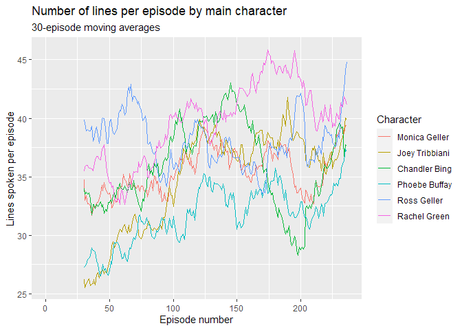
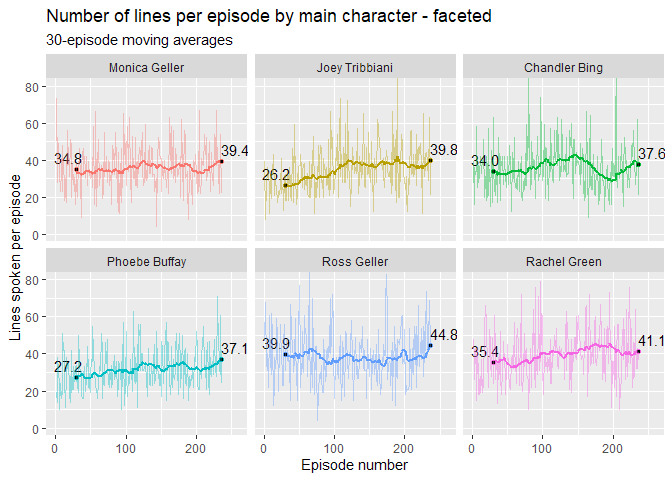

Friends Analysis Report
================
Callum Orkney
13/12/2020

    ## 
    ##  Downloading file 1 of 3: `friends.csv`
    ##  Downloading file 2 of 3: `friends_info.csv`
    ##  Downloading file 3 of 3: `friends_emotions.csv`

## Analysis of number of lines

Summarising the data by episode and character, we can see how the number
of lines per episode for each character has changed over time. To avoid
an unreadable mess, let’s calculate a 30-episode moving average:

``` r
lines_by_character <- lines_clean %>%
  filter(speaker %in% names_six) %>%
  group_by(ep_id, ep_no, speaker) %>% 
  summarise(lines = n()) %>%
  ungroup() %>% 
  group_by(speaker) %>%
  mutate(movav = roll_meanr(lines, movav_eps)) %>%
  ungroup()
```

Let’s plot a line graph of this, with one line representing each
character’s moving average lines-per-episode over time:

<!-- -->

It looks like there’s some significant change over time for some
characters, and the trend overall appears to be an upward one. There
also seems to be a more even distribution of lines among the characters
towards the end of the show. So we can deduce from this plot that
episodes contained more lines (although not necessarily more words\!)
near the end of the show’s run than at its beginning. Note that, if we
assume around 30 episodes per season, we can roughly take the starts of
these lines as season 1 averages and the ends as season 10 averages.

It’s a little hard to distinguish the series for each character, though.
Let’s create a faceted version of this plot so that we can see the
changes for each character more clearly:

<!-- -->

We can see more clearly now that the average number of lines spoken per
episode was higher at the end of the show than at the start for all
characters, and that Joey and Phoebe saw the most significant increases.
Though all characters fluctuated over time (the time series for
individual episodes have been added here with higher transparancy),
these two had significantly fewer lines per episode in the first season
than the other main characters. This may reflect Joey and Phoebe’s early
status as “light relief” characters that didn’t drive the main plot
points or romantic storylines - from my (possibly inaccurate) memory,
those things were more the domain of Monica, Ross and Rachel in those
days. I don’t remember Chandler driving much of the early plot either,
but I suppose his role as “the funny one” gave him a lot of lines.

## Things to do:

### Lines per character represented by distributions/boxplots

### Can we predict ratings based on lines spoken by each character? (Linear/RF regression)

### Break lines down into words (tidytext) and do some NLP - sentiment analysis / n-grams (popular 3/4-word phrases for each character?) / wordclouds / top words / topic modelling?
